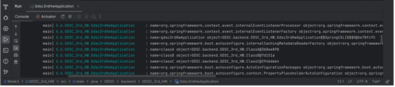
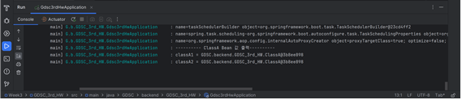

1.

Spring Bean은 스프링 IoC 컨테이너에 의해 관리되는 자바 객체다. 스프링 IoC는 빈을 관리하는 객체로 ApplicationContext 라는 인터페이스가 IoC 컨테이너를 대표한다. 한 개체가 다른 객체를 사용할 때 의존성 있다고 하며 클래스 간에 의존관계가 있다는 것은 한 클래스가 바뀔 때 다른 클래스가 영향을 받는다는 것을 의미하는데 Spring Bean은 이런 의존성 문제를 더 쉽게 해결할 수 있도록 한다.

 빈은 생성되고 존재하고 적용되는 범위를 지정할 수 있는데 이를 빈 스코프라고 한다. 스프링은 다양한 스코프를 지원하는데 기본 스코프로 스프링 컨테이너의 시작과 종료까지 유지되는 가장 넓은 범위의 스코프인 싱글톤, 스프링 컨테이너는 프로토타입 빈의 생성과 의존관계 주입까지만 관여하고 더는 관리하지 않는 매우 짧은 범위의 스코프인 프로토타입, 웹 관련 스코프인 request, session, application이 있다. 빈의 스코프는 @Scope 어노테이션을 통해 지정할 수 있다.

 스프링 IoC 컨테이너가 빈을 관리하는 방법은 
1. 객체 생성 + property 설정 - 먼저 Spring IoC 컨테이너가 생성이 되면 빈 스코프가 싱글톤인 객체를 생성한다. 이때 빈으로 등록하기 위해서 다양한 Configuration 메타데이터를 이용하여 통일된 Bean Definition을 생성한다. 그리고 빈으로 등록할 POJO와 Bean Definition 정보를 이용하여 빈을 생성한다. 이 과정에서 싱글톤 패턴을 사용하는 것이 아닌 평범한 자바 클래스를 이용하여 객체를 생성한다. 
2. 의존 설정 - 빈 객체가 생성이 되면 IoC 컨테이너는 의존 설정을 하고 이때 의존성 자동 주입이 일어나게 된다. 
3. 객체 초기화 -> 사용 -> 소멸 - 사용 전에 초기화 과정이 필요한 객체들은 초기화 과정을 진행하고 끝나면 빈을 사용할 수 있게 된다. 그리고 스프링 컨테이너가 종료될 때 빈 스코프가 싱글톤인 객체들도 함께 소멸된다.

2.

 Component scan이란 스프링이 애플리케이션의 클래스를 검색하고, 자동으로 스프링 빈을 등록하는 방법이다, @ComponentScan ,@Component 어노테이션을 이용하면 되고, 빈을 자동으로 구성함으로써 애플리케이션의 구성 및 설정을 간소화할 수 있다.
@Component는 스프링 빈으로 등록하려는 클래스에 붙일 수 있는 어노테이션이다. 스프링은 이 어노테이션이 붙은 클래스를 자동으로 검색하고 빈으로 등록한다. 
@ComponentScan 어노테이션은 스프링이 어느 패키지에서 클래스 검색을 시작할지 및 검색할 패키지의 범위를 설정할 수 있다.
@Configuration이 붙은 클래스도 빈 등록이 되며 내부의 @Bean 어노테이션으로 수동으로 등록한 빈 또한 빈으로 등록이 된다. 

