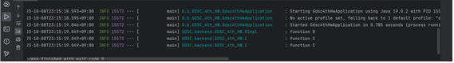

1.
DI에 대해 정리하라

DI는 의존성 주입으로 Dependency Injection이다. DI란 외부에서 두 객체 간의 관계를 결정해주는 디자인 패턴으로, 인터페이스를 사이에 둬서 클래스 레벨에서는 의존관계가 고정되지 않도록 하고 런타임 시에 관계를 동적으로 주입하여 유연성을 확보하고 결합도를 낮출 수 있게 해준다.

 의존성 주입은 크게 4가지가 있는데 생성자 주입, 수정자 주입, 필드 주입, 일반 메소드 주입니다. 생성자 주입은 생성자를 통해 의존관계를 주입하는 방법으로 생성자 주입을 사용하면 객체의 최초 생성 시점에 스프링이 의존성을 주입해준다. 그렇기에 주입받은 객체가 변하지 않거나, 반드시 객체의 주입이 필요한 경우에 강제하기 위해 사용할 수 있다. 또한 Spring 프레임워크에서는 생성자 주입을 적극 지원하고 있기 때문에, 생성자가 1개만 있을 경우에 @Autowired를 생략해도 주입이 가능하다. 만약 @Autowired 가 붙은 생성자가 여러 개 있을 경우 가장 많은 의존성을 주입할 수 있는 생성자를 사용해서 의존성 주입한다.

 setter 주입은 setter라 불리는 필드의 값을 변경하는 수정자 메서드를 통해서 의존관계를 주입하는 방법이다. 선택, 변경 가능성이 있는 의존관계에 사용할 수 있으며 setter 메서드에 @Autowired 어노테이션을 붙이면 스프링이 setter를 사용해서 자동으로 의존성을 주입해준다. 이때 빈 객체를 만들고 setter로 의존성을 주입해주기 때문에 빈 생성자가 필요하다. 

 필드 주입은 말 그대로 필드에 바로 주입하는 방법으로 더 이상 추천되는 방법이 아니다. 필드 주입을 사용하게 되면 테스트 등의 이유로 자동이 아닌 수동 의존성을 주입하고 싶어도, 생성자, setter가 없으므로 직접 의존성을 넣어줄 수가 없다. 때문에 필드 주입을 사용하게 되면 의존성이 프레임워크에 강하게 종속된다는 문제점이 있다. 

일반 메소드 주입은 한번에 여러 필드를 주입 받을 수 있지만 일반적으로 잘 안 쓴다.

2.
Spring Boot에 대해 정리하라.

 Spring Boot는 스프링 기반의 어플리케이션를 빠르게 개발하고 실행하기 위한 프레임워크다. 개발에 필요한 복잡한 설정을 Spring Boot가 대신 해줌으로써, 개발자의 편리한 Spring 사용에 도움을 준다.

 Spring Boot의 특징으로는 
1. WAS -> Tomcat 같은 웹 서버를 내장해서 별도의 웹 서버를 설치하지 않아도 된다.
2. 라이브러리 관리 -> 손쉬운 빌드 구성을 위한 스타터 종속성을 제공하고 라이브러리 버전을 관리한다.
3. 자동 구성 -> 프로젝트 시작에 필요한 스프링과 외부 라이브러리의 빈을 자동 등록하고 스프링 애플리케이션에 공통으로 필요한 애플리케이션 기능을 자동으로 구성한다.
4. 외부 설정 -> 환경에 따라 달라져야 하는 외부 설정을 공통화한다.
5. 프로덕션 준비 -> 모니터링을 위한 메트릭, 상태 확인 기능을 제공한다.
    - 스프링 애플리케이션 컨텍스트에 구성된 빈
    - 스프링 부트의 자동 구성으로 구성된 것
    - 애플리케이션에서 사용할 수 있는 환경 변수, 시스템 프로퍼티, 구성 프로퍼티, 명령줄 인자
    - 최근에 처리된 HTTP 요청 정보
    - 메모리 사용량, 가비지 컬렉션, 웹 요청, 데이터 소스 사용량 등 다양한 메트릭

    